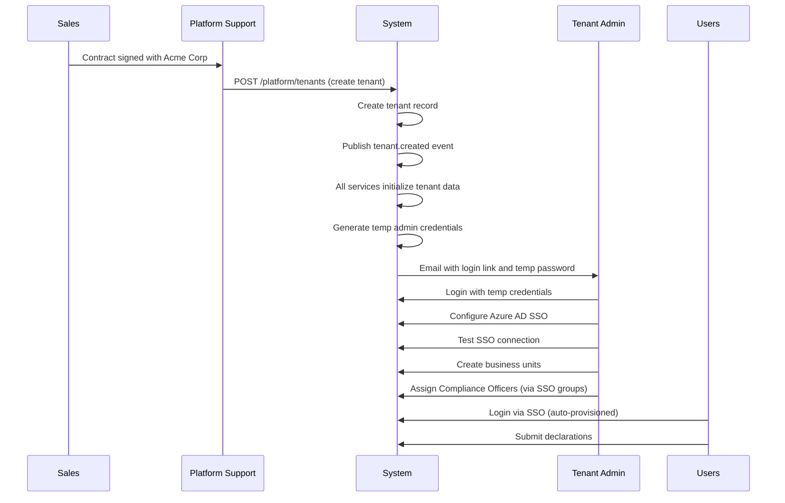

# Roles and Personas
## ComplianceFlow Platform

**Version:** 1.0  
**Date:** October 4, 2025  
**Status:** Active Reference Document  
**Purpose:** Define all user roles and personas for platform and tenant operations

---

## 🎭 Role Model Overview

ComplianceFlow is a **multi-tenant SaaS platform**. This means we have two distinct sets of roles:

1. **Platform Roles** - Our company's staff who operate the SaaS platform
2. **Tenant Roles** - Customer organization users who use the platform

### Critical Distinction

| Aspect | Platform Roles | Tenant Roles |
|--------|---------------|--------------|
| **Employer** | ComplianceFlow (SaaS company) | Customer organization |
| **Scope** | Cross-tenant (can see all customers) | Single tenant only |
| **Access** | Platform infrastructure, billing, support | Business operations within tenant |
| **Data Access** | Can access any tenant (with audit) | Only their tenant's data |
| **Examples** | Onboarding customers, platform maintenance | Configuring compliance rules, reviewing declarations |

---

## 🏢 Platform Roles (ComplianceFlow Company Staff)

### Platform Super Admin
**Who They Are:** CTO, Senior DevOps Engineers  
**Purpose:** Full platform access for emergencies and critical operations

**Permissions:**
- ✅ Full access to all tenants
- ✅ Create/suspend/delete tenants
- ✅ Rotate JWT signing keys (affects all tenants)
- ✅ Access platform infrastructure
- ✅ View billing and usage data
- ✅ Perform database operations
- ✅ Emergency break-glass operations

**Use Cases:**
- Security incident response
- Platform-wide configuration changes
- Emergency tenant access
- Critical bug fixes

**Database:**
- `tenant_id: null` (platform-level user)
- `roles: ['platform_admin']`

---

### Platform Support
**Who They Are:** Customer Success, Support Engineers, Account Managers  
**Purpose:** Onboard customers and provide ongoing support

**Permissions:**
- ✅ Create new tenants (customer onboarding)
- ✅ View tenant details and statistics
- ✅ Suspend/reactivate tenants (billing issues)
- ✅ Assist with SSO configuration (read-only or guided setup)
- ✅ Access customer data for support (with audit log)
- ❌ Cannot rotate platform JWT keys
- ❌ Cannot modify platform infrastructure

**Use Cases:**
- **New Customer Onboarding:**
  1. Sales signs contract with Acme Corp
  2. Platform Support creates tenant: "Acme Corp"
  3. System provisions databases, creates temp admin user
  4. Support sends onboarding email to customer admin
  5. Customer admin logs in, configures SSO
  6. Employees can now log in via SSO

- Customer support tickets
- Troubleshooting SSO issues
- Usage reporting for accounts
- Contract renewals/suspensions

**Database:**
- `tenant_id: null` (platform-level user)
- `roles: ['platform_support']`

---

### Platform DevOps
**Who They Are:** Infrastructure Engineers, SREs  
**Purpose:** Manage platform infrastructure and deployments

**Permissions:**
- ✅ Deploy services
- ✅ Manage infrastructure (Terraform)
- ✅ View monitoring and logs across all tenants
- ✅ Perform database maintenance
- ✅ Configure alerting
- ❌ Cannot create/suspend tenants
- ❌ Cannot access tenant business data

**Use Cases:**
- Infrastructure deployment
- Performance optimization
- Incident response
- Scaling operations
- Backup/restore operations

**Database:**
- `tenant_id: null` (platform-level user)
- `roles: ['platform_devops']`

---

## 🏛️ Tenant Roles (Customer Organization Users)

### Tenant Admin
**Who They Are:** IT administrators within the customer organization  
**Purpose:** Configure and manage the platform for their organization

**Permissions:**
- ✅ Configure SSO for their organization
- ✅ Manage users within their tenant (CRUD, suspend, deactivate)
- ✅ Assign roles to users (promote to Compliance Officer, Reviewer)
- ✅ Create/manage business units
- ✅ View tenant-wide analytics
- ❌ Cannot access other tenants' data
- ❌ Cannot manage platform infrastructure
- ❌ Cannot create tenants

**Use Cases:**
- **Initial Setup After Provisioning:**
  1. Receive onboarding email from Platform Support
  2. Log in with temporary credentials
  3. Configure Azure AD SSO for organization
  4. Test SSO configuration
  5. Invite other administrators
  6. Set up business unit structure
  7. Assign initial Compliance Officers

- Employee onboarding/offboarding
- SSO reconfiguration (provider change)
- Business unit restructuring
- User role management

**Database:**
- `tenant_id: <specific-tenant>` (belongs to one tenant)
- `roles: ['tenant_admin']`
- Usually also has `['user']` role

---

### Compliance Officer
**Who They Are:** Compliance team members within the customer organization  
**Purpose:** Manage compliance programs (NOT user management)

**Permissions:**
- ✅ Configure declaration types and forms
- ✅ Define business rules for evaluations
- ✅ Manage reviewer groups and assignments
- ✅ Investigate cases
- ✅ View all declarations in their tenant
- ✅ Perform break-glass approvals
- ✅ Configure notification templates
- ✅ View compliance analytics
- ❌ Cannot manage users (that's Tenant Admin)
- ❌ Cannot configure SSO (that's Tenant Admin)
- ❌ Cannot access other tenants

**Use Cases:**
- Configure gift/entertainment rules
- Set up reviewer groups
- Investigate flagged transactions
- Generate compliance reports
- Adjust approval thresholds
- Manage declaration forms

**Database:**
- `tenant_id: <specific-tenant>`
- `roles: ['compliance_officer']`
- Usually also has `['user']` role

**Key Point:** Compliance Officers work WITH compliance programs, not WITH system administration.

---

### Reviewer
**Who They Are:** Managers, supervisors who review employee declarations  
**Purpose:** Review and approve/deny declarations

**Permissions:**
- ✅ View assigned declarations
- ✅ Approve/deny declarations
- ✅ Request additional information
- ✅ Add comments to reviews
- ✅ Escalate to Compliance Officers
- ✅ View their review queue
- ✅ View their performance metrics
- ❌ Cannot see unassigned declarations
- ❌ Cannot configure rules or forms
- ❌ Cannot access other tenants

**Use Cases:**
- Review employee gift declarations
- Approve/deny personal trade preclearance
- Request clarification from submitter
- Escalate suspicious activity
- Track review workload

**Database:**
- `tenant_id: <specific-tenant>`
- `business_unit_id: <specific-unit>`
- `roles: ['reviewer']`
- Usually also has `['user']` role

---

### User
**Who They Are:** All employees in the customer organization  
**Purpose:** Submit declarations

**Permissions:**
- ✅ Submit declarations (gifts, trades, entertainment)
- ✅ View own declarations
- ✅ View own declaration history
- ✅ Upload supporting documents
- ✅ Respond to information requests
- ❌ Cannot see others' declarations
- ❌ Cannot configure anything
- ❌ Cannot access other tenants

**Use Cases:**
- Submit gift received declaration
- Request trade preclearance
- Complete quarterly holdings attestation
- Upload receipts/documentation
- Track approval status

**Database:**
- `tenant_id: <specific-tenant>`
- `business_unit_id: <specific-unit>`
- `roles: ['user']`

---

## 🔀 Role Assignment Matrix

### Who Assigns What

| Role | Assigned By | When | How |
|------|------------|------|-----|
| **Platform Admin** | Manual (company hire) | Employee onboarding | Direct database update |
| **Platform Support** | Platform Admin | Employee onboarding | Platform admin UI |
| **Platform DevOps** | Platform Admin | Employee onboarding | Platform admin UI |
| **Tenant Admin** | Platform Support | Customer onboarding | Auto-created during tenant provisioning |
| **Compliance Officer** | Tenant Admin | After SSO setup | Via SSO group mapping or manual assignment |
| **Reviewer** | Tenant Admin | As needed | Via SSO group mapping or manual assignment |
| **User** | Automatic | First SSO login | Default role for all authenticated users |

---

## 🔄 Typical Customer Onboarding Flow

---

## 🔐 Permission Scoping

### Tenant Isolation Rules

**Platform Roles:**
- Can access data across ANY tenant
- All actions logged with tenant_id for audit
- Used sparingly, primarily for support and operations

**Tenant Roles:**
- Can ONLY access data from their own tenant
- `tenant_id` extracted from JWT token
- Database queries automatically filter by tenant_id
- Attempting to access other tenant = 403 Forbidden + security alert

### URL Patterns by Role Scope

**Platform Endpoints:**
- `/api/v1/platform/*` - Platform admin operations
- Example: `/api/v1/platform/tenants` - List all customers
- Authorization: platform_admin or platform_support

**Tenant Admin Endpoints:**
- `/api/v1/admin/*` - Tenant administration within organization
- Example: `/api/v1/admin/sso-config` - Configure my organization's SSO
- Authorization: tenant_admin (tenant-scoped)

**Tenant Operations:**
- `/api/v1/*` - Normal tenant operations
- Example: `/api/v1/users/{id}` - Get user (tenant-isolated)
- Authorization: Various tenant roles with appropriate permissions

---

## 🚨 Critical Security Considerations

### Tenant Isolation is Mandatory
- **Every database query** must filter by tenant_id (except platform roles)
- **JWT tokens** must include tenant_id claim
- **Authorization middleware** must enforce tenant boundaries
- **Test thoroughly** - tenant data leakage is catastrophic

### Platform Role Audit Requirements
- **All platform role actions logged** with tenant_id accessed
- **Support access** requires ticket number for justification
- **Regular audit reviews** of platform role actions
- **Alerts** on platform role accessing multiple tenants rapidly

---

## 📚 References

**Related Documentation:**
- **Main PRD:** `prds/PRD_ComplianceFlow.md` - Platform overview with updated personas
- **User Service PRD:** `prds/PRD_UserService.md` - Implementation details
- **Workflow:** `AI_Assisted_Development_Workflow.md` - How to use role definitions

**Version History:**

| Version | Date | Changes |
|---------|------|---------|
| 1.0 | Oct 4, 2025 | Initial role model definition - platform vs tenant roles clarified |
