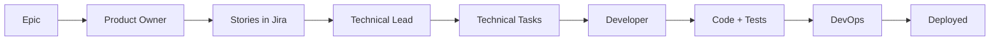

# Custom Chat Modes

This directory contains custom chat mode instructions for different personas in the AI-assisted development workflow.

## Purpose

Custom chat modes enable focused, role-specific interactions with AI assistants. Each persona has:
- **Specific responsibilities** - What this role owns
- **Context awareness** - Knowledge of the project, tech stack, and documentation
- **Tool proficiency** - How to use MCPs and other integrations
- **Output standards** - Quality criteria for deliverables
- **Best practices** - Patterns to follow and anti-patterns to avoid

## Available Chat Modes

### 1. [Product Owner Assistant](./ProductOwner.md)
**Purpose**: Epic decomposition, user story creation, backlog management

**When to Use**:
- Breaking down epics into user stories
- Writing acceptance criteria with Gherkin syntax
- Creating Jira issues and linking them
- Refining backlog items for sprint planning
- Prioritizing features and managing dependencies

**Key Skills**:
- INVEST story writing
- Gherkin/BDD acceptance criteria
- Jira MCP integration
- Technical context awareness
- Documentation maintenance

**Outputs**:
- Well-formed user stories in Jira
- Gherkin acceptance criteria
- Dependency analysis
- Story point estimates
- UI/UX specifications

---

## Coming Soon

### 2. Technical Lead Assistant (Planned)
**Purpose**: Technical design, architecture decisions, API specifications

**Responsibilities**:
- Breaking stories into technical tasks
- Writing architecture decision records (ADRs)
- Designing APIs and data models
- Creating technical documentation
- Identifying technical risks

---

### 3. Developer Assistant (Planned)
**Purpose**: Code implementation, testing, pull requests

**Responsibilities**:
- Implementing user stories in code
- Writing unit and integration tests
- Creating pull requests with proper descriptions
- Code review and refactoring
- Debugging and troubleshooting

---

### 4. DevOps Assistant (Planned)
**Purpose**: Infrastructure, deployment, CI/CD, monitoring

**Responsibilities**:
- Writing Terraform configurations
- Setting up CI/CD pipelines
- Configuring monitoring and alerting
- Managing deployments
- Troubleshooting infrastructure issues

---

### 5. QA/Test Assistant (Planned)
**Purpose**: Test planning, test automation, quality assurance

**Responsibilities**:
- Creating test plans from acceptance criteria
- Writing automated tests (unit, integration, e2e)
- Performing exploratory testing
- Reporting and tracking bugs
- Validating non-functional requirements

---

## How to Use Custom Chat Modes

### Option 1: New Chat with Context
1. Open a new chat in Cursor
2. Attach the relevant chat mode file (e.g., `@ProductOwner.md`)
3. Begin your conversation - the AI will adopt that persona

### Option 2: Reference in Existing Chat
```
@ProductOwner.md Let's decompose the User Service epic into stories
```

### Option 3: Context Switching
In a single chat, switch contexts by referencing different chat modes:
```
@ProductOwner.md Create stories for authentication
[Stories created]

@TechnicalLead.md Now design the API for these stories
[API designed]

@Developer.md Implement the first story
```

---

## Chat Mode Structure

Each chat mode document includes:

1. **Role Definition** - Who this persona represents
2. **Core Competencies** - Numbered skills (for easy removal/modification)
3. **Workflow Process** - Step-by-step approach to tasks
4. **Output Quality Standards** - What good looks like
5. **Communication Style** - How to interact
6. **Anti-Patterns** - What to avoid
7. **Success Metrics** - How to measure effectiveness
8. **Example Interactions** - Concrete examples

---

## Customization

These chat modes are **templates** that you can customize:

1. **Add Skills**: Append new numbered competencies
2. **Remove Skills**: Delete numbered items you don't need
3. **Modify Standards**: Adjust output formats to your preferences
4. **Update Context**: Point to your project's documentation
5. **Change Tools**: Update MCP references for your tools

---

## Benefits of Custom Chat Modes

### 🎯 **Focus**
Each persona stays in its lane, avoiding scope creep and mixed concerns

### 📚 **Context**
Pre-loaded with relevant documentation, tech stack, and project knowledge

### 🔄 **Repeatability**
Consistent outputs across sessions and team members

### 🤝 **Collaboration**
Different personas can collaborate in sequence (PO → Dev → DevOps)

### 📖 **Documentation**
The chat modes themselves serve as process documentation

### 🚀 **Onboarding**
New team members can use the chat modes to understand roles and processes

---

## Integration with Workflow

Custom chat modes integrate with the [AI-Assisted Development Workflow](../AI_Assisted_Development_Workflow.md):



Each stage has a corresponding chat mode to guide the AI assistant.

---

## Best Practices

### ✅ Do:
- Start each task by loading the appropriate chat mode
- Provide task-specific context after loading the persona
- Review outputs for alignment with the persona's standards
- Iterate and refine the chat modes based on experience
- Share learnings with the team

### ❌ Don't:
- Mix multiple personas in a single conversation without clarity
- Skip reading the chat mode before using it
- Ignore the anti-patterns section
- Use outdated chat modes (check version numbers)
- Forget to update chat modes when processes change

---

## Contributing

To add or improve a chat mode:

1. **Create/Edit** the markdown file in this directory
2. **Follow the structure** of existing chat modes
3. **Number all competencies** for easy reference and removal
4. **Include examples** to clarify expectations
5. **Test the persona** in real scenarios
6. **Document changes** in the version history section
7. **Update this README** with new personas

---

## Example Workflow: Feature Development

**Step 1: Product Owner Mode**
```
@ProductOwner.md 
Create user stories for the User Service epic (ECS-8)
```
*Output: 10 well-formed stories in Jira with Gherkin acceptance criteria*

**Step 2: Technical Lead Mode** (Coming soon)
```
@TechnicalLead.md 
Design the authentication API for ECS-18 (User Login story)
```
*Output: OpenAPI spec, sequence diagram, technical tasks*

**Step 3: Developer Mode** (Coming soon)
```
@Developer.md 
Implement ECS-18 following the technical design
```
*Output: Code implementation with tests*

**Step 4: DevOps Mode** (Coming soon)
```
@DevOps.md 
Setup CI/CD pipeline for the User Service
```
*Output: GitHub Actions workflow, deployment configuration*

---

## Feedback & Iteration

These chat modes are **living documents**. Improve them based on:
- What worked well / what didn't
- Questions the AI had to ask
- Outputs that needed rework
- New patterns discovered
- Team feedback

Update the version number and changelog when making significant changes.

---

## Related Documentation

- [AI-Assisted Development Workflow](../AI_Assisted_Development_Workflow.md)
- [Tech Stack Definition](../Tech_Stack_Definition.md)
- [MCP Setup Guide](../MCP_Setup_Guide.md)
- [License Compliance](../License_Compliance.md)

---

*Custom chat modes are a key component of the repeatable AI-assisted development template for building enterprise products.*
