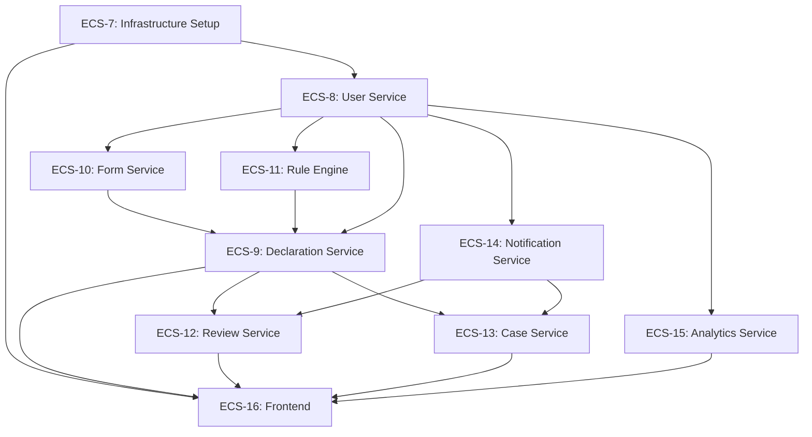

# Implementation Sequence & Dependencies
## ComplianceFlow Platform

### Document Information
- **Version**: 1.0
- **Date**: October 4, 2025
- **Status**: Active Planning Document
- **Purpose**: Define epic implementation order and track dependencies

---

## 1. Epic Dependency Map

### Visual Dependency Graph



---

## 2. Epic Implementation Sequence

### Phase 1: Foundation (Week 1)
**Sprint Goal**: Establish infrastructure and development environment

#### ECS-7: Infrastructure Setup
- **Status**: TO DO
- **Dependencies**: None (Azure subscription, GitHub repo already setup)
- **Blocks**: ALL other epics
- **Deliverables**:
  - Azure infrastructure (PostgreSQL, Redis, Kafka, Key Vault)
  - Terraform modules for all environments
  - Docker Compose for local development
  - CI/CD pipelines (GitHub Actions)
  - Monitoring and logging setup
- **Story Count**: ~8-12 stories
- **Estimated Duration**: 1 sprint (1 week)

---

### Phase 2: Identity & Authentication (Week 2)
**Sprint Goal**: Enable user authentication and authorization

#### ECS-8: User Service
- **Status**: TO DO
- **Dependencies**: ECS-7 (Infrastructure)
- **Blocks**: ALL other services (authentication required)
- **Deliverables**:
  - User CRUD operations
  - Azure AD SSO integration
  - JWT token generation/validation
  - Role management (User, Reviewer, Compliance Officer)
  - Business unit management
  - Event publishing for user lifecycle
- **Story Count**: ~10-15 stories
- **Estimated Duration**: 1 sprint (1 week)

---

### Phase 3: Supporting Services (Weeks 3-4)
**Sprint Goal**: Build independent supporting services

#### ECS-10: Form Service
- **Status**: TO DO
- **Dependencies**: ECS-8 (User Service for auth)
- **Blocks**: ECS-9 (Declaration Service)
- **Deliverables**:
  - Dynamic form builder API
  - Form versioning and publishing
  - Field types (text, dropdown, checkbox, date, file, number, currency)
  - Conditional field logic
  - Business unit-based form selection
- **Story Count**: ~12-18 stories
- **Estimated Duration**: 1 sprint (1 week)
- **Can Parallel With**: ECS-14, ECS-11

#### ECS-14: Notification Service
- **Status**: TO DO
- **Dependencies**: ECS-8 (User Service for auth)
- **Blocks**: ECS-12 (Review Service), ECS-13 (Case Service)
- **Deliverables**:
  - Email notification sending
  - Template management with variable substitution
  - Event consumers for all platform events
  - Delivery tracking and retry logic
- **Story Count**: ~8-12 stories
- **Estimated Duration**: 1 sprint (1 week)
- **Can Parallel With**: ECS-10, ECS-11

#### ECS-11: Rule Engine Service
- **Status**: TO DO
- **Dependencies**: ECS-8 (User Service for auth)
- **Blocks**: ECS-9 (Declaration Service)
- **Deliverables**:
  - Rule definition API with binary tree expressions
  - Rule evaluation engine
  - Conflict resolution (worst case wins)
  - Audit logging for all evaluations
  - Rule versioning
- **Story Count**: ~10-15 stories
- **Estimated Duration**: 1 sprint (1 week)
- **Can Parallel With**: ECS-10, ECS-14

---

### Phase 4: Core Workflow (Week 5)
**Sprint Goal**: Implement declaration workflow orchestration

#### ECS-9: Declaration Service
- **Status**: TO DO
- **Dependencies**: ECS-8, ECS-10, ECS-11
- **Blocks**: ECS-12, ECS-13, ECS-16 (core functionality)
- **Deliverables**:
  - Declaration lifecycle management
  - Form data storage and validation
  - File attachment handling (Azure Blob Storage)
  - Integration with Form Service
  - Integration with Rule Engine
  - Event publishing for declaration lifecycle
- **Story Count**: ~12-18 stories
- **Estimated Duration**: 1 sprint (1 week)

---

### Phase 5: Review & Case Management (Weeks 6-7)
**Sprint Goal**: Enable human review workflows and case investigations

#### ECS-12: Review Service
- **Status**: TO DO
- **Dependencies**: ECS-8, ECS-9, ECS-14
- **Blocks**: ECS-16 (reviewer UI)
- **Deliverables**:
  - Review group management
  - Reviewer assignment logic
  - Review workflow (approve, deny, comment, request info, escalate)
  - Break-glass functionality
  - Aged review tracking
- **Story Count**: ~10-15 stories
- **Estimated Duration**: 1 sprint (1 week)
- **Can Parallel With**: ECS-13

#### ECS-13: Case Service
- **Status**: TO DO
- **Dependencies**: ECS-8, ECS-9, ECS-14
- **Blocks**: ECS-16 (case management UI)
- **Deliverables**:
  - Case lifecycle management
  - Investigation note tracking
  - File attachment support
  - Case findings documentation
  - Silent vs escalated case types
- **Story Count**: ~8-12 stories
- **Estimated Duration**: 1 sprint (1 week)
- **Can Parallel With**: ECS-12

---

### Phase 6: Analytics (Week 8)
**Sprint Goal**: Provide reporting and metrics capabilities

#### ECS-15: Analytics Service
- **Status**: TO DO
- **Dependencies**: ECS-8 (minimum), benefits from all services being complete
- **Blocks**: ECS-16 (analytics dashboards)
- **Deliverables**:
  - Metrics collection from all platform events
  - Dashboard APIs
  - Historical trend analysis
  - Data export (CSV)
  - Real-time aggregation
- **Story Count**: ~10-15 stories
- **Estimated Duration**: 1 sprint (1 week)

---

### Phase 7: Frontend Application (Weeks 9-12)
**Sprint Goal**: Deliver user-facing web application

#### ECS-16: Frontend Application
- **Status**: TO DO
- **Dependencies**: ALL backend services (ECS-7 through ECS-15)
- **Blocks**: Nothing (last epic)
- **Deliverables**:
  - React + TypeScript application
  - Azure AD SSO authentication
  - Role-based views (User, Reviewer, Compliance Officer)
  - Dynamic form rendering
  - Review workflow UI
  - Case management UI
  - Form and rule builder UIs
  - Analytics dashboards
  - Responsive design (mobile, tablet, desktop)
  - Accessibility (WCAG 2.1 AA)
- **Story Count**: ~30-40 stories
- **Estimated Duration**: 3-4 sprints (3-4 weeks)

---

## 3. Dependency Matrix

| Epic | Depends On | Blocks | Can Parallel With |
|------|------------|--------|-------------------|
| **ECS-7: Infrastructure** | None | ALL | None |
| **ECS-8: User Service** | ECS-7 | ALL | None |
| **ECS-10: Form Service** | ECS-8 | ECS-9 | ECS-11, ECS-14 |
| **ECS-11: Rule Engine** | ECS-8 | ECS-9 | ECS-10, ECS-14 |
| **ECS-14: Notification** | ECS-8 | ECS-12, ECS-13 | ECS-10, ECS-11 |
| **ECS-9: Declaration** | ECS-8, ECS-10, ECS-11 | ECS-12, ECS-13, ECS-16 | None |
| **ECS-12: Review Service** | ECS-8, ECS-9, ECS-14 | ECS-16 | ECS-13 |
| **ECS-13: Case Service** | ECS-8, ECS-9, ECS-14 | ECS-16 | ECS-12 |
| **ECS-15: Analytics** | ECS-8 | ECS-16 | ECS-9, ECS-12, ECS-13 |
| **ECS-16: Frontend** | ECS-7 through ECS-15 | None | None |

---

## 4. Critical Path

The **critical path** through the project (longest dependent chain):

```
ECS-7 → ECS-8 → ECS-10 → ECS-9 → ECS-12 → ECS-16
(Infrastructure → User → Form → Declaration → Review → Frontend)
```

**Total Critical Path Duration**: ~9-12 weeks

---

## 5. Parallelization Opportunities

### Sprint 3-4: Three Services in Parallel
After ECS-8 (User Service) is complete, these can be built simultaneously:
- **ECS-10: Form Service** (Developer A)
- **ECS-11: Rule Engine Service** (Developer B)
- **ECS-14: Notification Service** (Developer C)

### Sprint 6-7: Two Services in Parallel
After ECS-9 (Declaration Service) is complete:
- **ECS-12: Review Service** (Developer A)
- **ECS-13: Case Service** (Developer B)

---

## 6. Deferred Tasks

### GitHub Actions Path Filters
**Task**: Configure path-based workflow triggers for monorepo
**Rationale**: Deferred until services are implemented to avoid premature optimization
**When to Implement**: During CI/CD setup in ECS-7, create template but defer per-service filters until Phase 6 (Week 8)
**Location**: `.github/workflows/` with path filters like:
```yaml
on:
  push:
    paths:
      - 'services/user-service/**'
      - 'shared/**'
```

**Action Item**: Add story to ECS-7 for basic CI/CD setup, note that per-service path filters will be refined as services are added

---

## 7. Risk Mitigation

### High-Risk Dependencies
1. **Azure AD SSO Integration** (ECS-8)
   - Risk: SSO configuration issues can block all development
   - Mitigation: Create spike story to validate SSO integration early

2. **Kafka Event Streaming** (ECS-7)
   - Risk: Event-driven architecture complexity
   - Mitigation: Start with simple event schemas, iterate

3. **Rule Engine Complexity** (ECS-11)
   - Risk: Binary tree evaluation logic can be complex
   - Mitigation: Start with simple rules, add complexity incrementally

---

## 8. Quick Reference: Next Epic to Implement

**Current Epic**: ECS-7 (Infrastructure Setup)
**Next Epic**: ECS-8 (User Service)
**After That**: ECS-10, ECS-11, ECS-14 (in parallel)

---

## 9. Story Count Estimates

| Epic | Estimated Stories | Estimated Points | Duration |
|------|-------------------|------------------|----------|
| ECS-7: Infrastructure | 8-12 | 40-60 | 1 sprint |
| ECS-8: User Service | 10-15 | 50-70 | 1 sprint |
| ECS-10: Form Service | 12-18 | 60-80 | 1 sprint |
| ECS-11: Rule Engine | 10-15 | 50-70 | 1 sprint |
| ECS-14: Notification | 8-12 | 40-60 | 1 sprint |
| ECS-9: Declaration | 12-18 | 60-80 | 1 sprint |
| ECS-12: Review Service | 10-15 | 50-70 | 1 sprint |
| ECS-13: Case Service | 8-12 | 40-60 | 1 sprint |
| ECS-15: Analytics | 10-15 | 50-70 | 1 sprint |
| ECS-16: Frontend | 30-40 | 150-200 | 3-4 sprints |
| **TOTAL** | **118-172** | **590-880** | **12-16 weeks** |

---

## 10. Integration Milestones

### Milestone 1: Infrastructure Complete (End of Week 1)
- All Azure resources deployed
- Local development environment functional
- CI/CD pipelines operational

### Milestone 2: Authentication Complete (End of Week 2)
- Users can authenticate via Azure AD
- JWT tokens working
- Role-based access control functional

### Milestone 3: Supporting Services Complete (End of Week 4)
- Forms can be created and rendered
- Rules can be evaluated
- Notifications can be sent

### Milestone 4: Core Workflow Complete (End of Week 5)
- End-to-end declaration submission works
- Rules evaluate and route to review

### Milestone 5: Full Backend Complete (End of Week 8)
- All microservices operational
- Review workflows functional
- Case management working
- Analytics reporting available

### Milestone 6: MVP Complete (End of Week 12)
- Frontend application deployed
- All user journeys functional
- System ready for demo/testing

---

## 11. Notes

### Development Velocity Assumptions
- **1 Developer**: Sequential implementation, 12-16 weeks
- **2 Developers**: Some parallelization, 8-12 weeks
- **3 Developers**: Full parallelization, 6-10 weeks

### AI-Assisted Development
This timeline assumes AI-assisted development with Cursor AI, which can significantly accelerate:
- Boilerplate code generation
- Test case creation
- API documentation
- Bug fixing

### Consulting Portfolio Consideration
Document the journey throughout to build consulting portfolio:
- Blog posts after each major milestone
- Video demonstrations of key features
- Case study with velocity metrics
